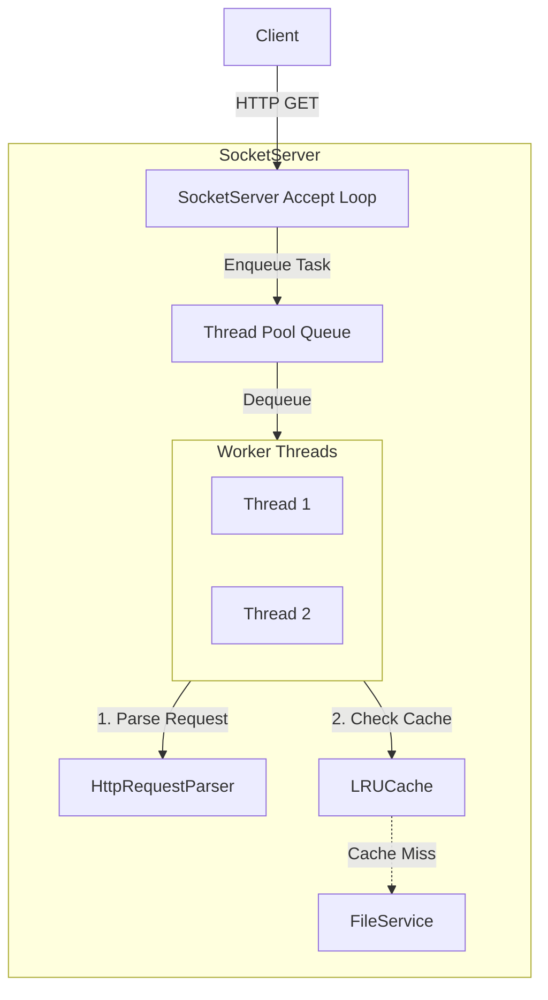

# High-Performance Multithreaded HTTP Server Walkthrough

Congratulations on completing the C++ HTTP/1.1 Server project! Here is a summary of the systems programming concepts we implemented over the past 8 phases:

## Final Architecture



## Accomplishments Checklist

- [x] **Project Setup**: Automated C++17 compilation with `CMakeLists.txt` and created a thread-safe Meyers Singleton `Logger`.
- [x] **Socket Foundation**: Wrapped raw POSIX sockets (`socket`, `bind`, `listen`, `accept`) in a robust C++ class using RAII to guarantee resource cleanup.
- [x] **HTTP Parsing**: Decoupled HTTP string parsing using `std::istringstream` to safely tokenize the Method, Path, and Version while handling malformed requests via exceptions.
- [x] **File Serving**: Implemented MIME type detection via `std::filesystem` and successfully sent images and HTML in binary mode. Created a custom `sendAll` loop to guarantee transmission across OS network buffers.
- [x] **Concurrency**: Built a custom, pre-allocated `ThreadPool` utilizing `std::mutex`, `std::condition_variable`, and lambda functions to serve multiple concurrent clients without CPU spinning.
- [x] **O(1) Memory Cache**: Implemented a highly efficient LRU Cache using a mapped doubly-linked list (`std::unordered_map` + `std::list::splice`) to bypass expensive disk system calls for hot files.
- [x] **Graceful Shutdown**: Handled asynchronous OS Interrupts (`SIGINT` via `sigaction`), safely unblocking the main loop and waiting for all thread pool worker threads to finish active transmissions via `join()`.
- [x] **Documentation**: Generated a comprehensive `README.md` designed to present perfectly for interviews.

## Validation & Testing

You can fully test the concurrency and caching performance using `ApacheBench`. Start your server on WSL:
```bash
./server 8080 8 50
```

Then run a stress test:
```bash
ab -n 5000 -c 100 http://localhost:8080/index.html
```
*This sends 5000 requests, 100 at a time simultaneously. You should notice the logs printing "Cache Hit" constantly!*

> [!TIP]
> **Interview Strategy**: When discussing this project, emphasize your choice of **O(1) Data Structures** (for the cache) and **Condition Variables** (for the Thread Pool). These two concepts heavily separate junior developers from systems-level engineers.
